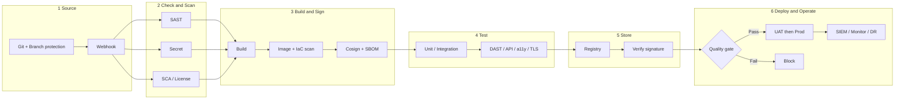

# DevSecOps CI/CD — Resource, Compliance & Skill Kit

**Version 1.3.1** — Store & Versioning adds Sonatype Nexus Repository OSS (Maven/npm/PyPI/Docker) and Zot, with package-repo controls mapped to Thai and international standards.

## GitHub Pages — เปิดใช้ได้เลย

https://chiraleo2000.github.io/cicd-resource-planner/

| หน้า | URL เต็ม |
|------|-----------|
| Planner (หน้าแรก) | https://chiraleo2000.github.io/cicd-resource-planner/ |
| Standalone HTML | https://chiraleo2000.github.io/cicd-resource-planner/planner-standalone.html |
| Air-gap copy | https://chiraleo2000.github.io/cicd-resource-planner/dist/planner-standalone.html |
| Excel ตารางทรัพยากร | https://chiraleo2000.github.io/cicd-resource-planner/dist/CICD_Tool_Resource_Matrix.xlsx |
| Catalog JSON | https://chiraleo2000.github.io/cicd-resource-planner/data/catalog.json |
| รายงาน compliance | https://chiraleo2000.github.io/cicd-resource-planner/reports/compliance.md |
| รายการลิงก์ทั้งหมด | https://chiraleo2000.github.io/cicd-resource-planner/pages.html |
| ซอร์สบน GitHub | https://github.com/chiraleo2000/cicd-resource-planner |

ใน Planner มี 7 แท็บ: วางแผนทรัพยากร, ตารางเครื่องมือ, Compliance, Storage, วิธีคำนวณ, **สถาปัตยกรรม**, **Pipeline และสคริปต์ติดตั้ง**

หลัง push ขึ้น `main` ให้รอ job **Deploy to GitHub Pages** เสร็จ แล้วรีเฟรชแบบข้ามแคช (Ctrl+F5)

---

ชุดความรู้และเครื่องมือสำหรับออกแบบ **CI/CD แบบ DevSecOps** ให้โครงการพัฒนาซอฟต์แวร์ในไทย
(ภาครัฐ / CII, เอกชน, internal, startup, AI/ML)

ต่อยอดจากเอกสารในโฟลเดอร์ `Data/` และทะเบียนมาตรฐานใน repo นี้:

- **CI/CD Service Blueprint V0.2** — ท่อ 6 ขั้น, รายการเครื่องมือ OSS/Enterprise, บทบาททีม, ช่วงต้นทุน
- **แนวปฏิบัติการพัฒนาซอฟต์แวร์ กฎระเบียบไซเบอร์ และสถาปัตยกรรมที่มั่นคงปลอดภัย V0.2** — กฎหมายไทย, OWASP Top 10:2025, Defense-in-Depth, Zero Trust
- **CICD Internal Service Proposal** — รูปแบบบริการภายใน, ขอบเขตส่งมอบ
- **Compliance Standards Register v4** — 155+ กฎหมาย/มาตรฐาน, WASS, 18 ประเภทสแกน, 12 เกณฑ์ Severity Gate
- **CI/CD Resource Planner** — เครื่องคำนวณทรัพยากร + ด่าน compliance ที่ตรวจด้วยสูตรเดียวกันทั้งเว็บและ Python

ไม่มีชื่อโครงการ หน่วยงาน หรือ IP ของลูกค้าฝังในไฟล์สาธารณะ — โจทย์จริงอยู่ที่ `โจทย์/` (gitignored)

---

## เปิดโปรแกรมวางแผน

### เปิดบนเครื่องตัวเอง

`index.html` ที่รากเป็นไฟล์เดียวจบ — ข้อมูลฝังในไฟล์แล้ว **ไม่ fetch JSON**

- ดับเบิลคลิก `index.html`
- หรือเปิดใน Simple Browser / Live Preview
- หรือ `serve.cmd` แล้วเปิด http://localhost:8000/

ถ้ายังเห็นข้อความโหลดไม่สำเร็จ ให้กด **Ctrl+F5** (ข้ามแคชของหน้าเก่า)

---

## DevSecOps ในชุดนี้คืออะไร

DevSecOps ที่นี่ไม่ใช่การ “เพิ่มสแกนเนอร์ท้ายท่อ” แต่เป็นการทำให้ **ความมั่นคงปลอดภัยเป็นเกณฑ์ผ่านของทุกขั้น** และผูกกับกฎหมายที่บังคับใช้จริง



| ขั้น | ต้องมี | เกณฑ์ภาครัฐที่พบบ่อย |
|------|--------|----------------------|
| 1 Source | Git, ≥2 approvers, audit trail | เก็บหลักฐานใครทำอะไรเมื่อไหร่, on-prem เมื่อเป็น CII |
| 2 Check | SAST, secret, SCA, license, quality | Critical = 0, ห้าม secret, ห้าม GPL/AGPL, coverage > 80% |
| 3 Build | Rootless image, IaC scan, sign, SBOM | ลงนาม artifact + SBOM บังคับ |
| 4 Test | DAST, API, WCAG AA, TLS 1.2+ | DAST ก่อนขึ้นโปรดักชัน |
| 5 Store | Private OCI registry + คลังแพ็กเกจ (Nexus), ตรวจลายเซ็น | ห้าม pull image/package จากสาธารณะโดยไม่ verify |
| 6 Operate | WAF, runtime, SIEM, log ≥ 90 วัน, BCP | แจ้งเหตุ PDPA 72 ชม., ซ้อมกู้คืนรายปี |

รายละเอียดควบคุมและเครื่องมือครบอยู่ใน Planner แท็บ 2–3 และใน `skills/_shared/`.

---

## กฎหมายและมาตรฐานที่ชุดนี้ครอบคลุม

ทะเบียนเต็มอยู่ใน `Compliance_Standards_Register_CICD_v4.xlsx` และถูก compile เข้าทุก skill pack

**กฎหมายไทยหลัก** — พ.ร.บ. ไซเบอร์ 2562 (CII 7 ภาคส่วน), PDPA 2562, พ.ร.บ. คอมพิวเตอร์ (log ≥ 90 วัน), พ.ร.บ. บริการภาครัฐดิจิทัล, มาตรฐานขั้นต่ำ 2566, มาตรฐานคลาวด์ 2567, มาตรฐานเว็บไซต์ 2568, มสพร. 11-2566 (WCAG AA)

**ลำดับรอง / รายภาคส่วน** — ประกาศ PDPC (CIA, แจ้งเหตุ 72 ชม., โอนต่างประเทศ), แนว Zero Trust / AI / PQC ของ สกมช., ธปท. / ก.ล.ต. / กสทช. / สธ. / PCI DSS, ข้อห้ามลิขสิทธิ์ GPL/AGPL ของงานจัดซื้อภาครัฐบางฉบับ

**สากล** — OWASP Top 10:2025 (รวม Supply Chain + Exceptional Conditions), ASVS, NIST SSDF / 800-161 / 800-207 / CSF 2.0, ISO 27001/27017/42001, CIS, SLSA, Sigstore, CycloneDX/SPDX, WCAG 2.2 AA, CISA KEV, DORA metrics

**WASS** — 18 ประเภทสแกน (SAST → EASM) และเกณฑ์ G-01…G-12 เช่น Critical/KEV บล็อกทันที, secret บล็อก+revoke ใน 24 ชม., ไม่มี SBOM/ลายเซ็น = บล็อกงานภาครัฐ

---

## โมเดลคำนวณทรัพยากร

เมื่อรวมหลายเครื่องมือบน VM เดียว ใช้ค่าที่มากสุดของสามเงื่อนไข แล้วบวก OS reserve (1 vCPU / 2 GB / 20 GB) แล้วปัดขึ้นตาม Allocation Ladder

```
A  Peak-Max        = MAX(min ของทุกเครื่องมือบนเครื่องนั้น)
B1 Strict          = Σ (min × w_i)
B2 Realistic       = resident บวกทุกตัว + MAX ของงานที่รันเรียงกัน
C  Resident Floor  = MAX(idle) + w_max(n) × (Σ idle − MAX(idle))
REQUIRED           = MAX(A, B, C) + OS reserve
```

น้ำหนักเดี่ยว 20–60% (`w_solo = 0.20 + 0.40 × activity_index`) แล้วลดเพดานตามจำนวนเครื่องมือ self-hosted บน VM นั้น: 60% → 20% ที่ n = 8+

แท็บ **6. สถาปัตยกรรม** และ **7. Pipeline และสคริปต์ติดตั้ง** สร้าง mermaid + YAML (GitLab/GitHub/Azure/Jenkins) และไฟล์ `install/*.sh` ต่อเครื่อง จากเครื่องมือที่เลือก

Scale Factor จากปริมาณงานจริง (ฐาน = 10 build/วัน, 2 แอป, ทีม 10 คน):

`0.55×(build/10) + 0.30×(แอป/2) + 0.15×(ทีม/10)`

เครื่องมือ cloud แบบ managed (Azure DevOps, GitHub Actions, ACR/ECR/GAR, AKS/EKS/GKE, Key Vault / Secrets Manager, Monitor / CloudWatch / Cloud Operations) มี `min = 0` — ไม่กินโควตา VM ในองค์กร แต่ **ไม่ถูกเลือกอัตโนมัติแทน OSS** เมื่อโปรไฟล์เป็นภาครัฐหรือ air-gapped

---

## โครงสร้าง repo

```
index.html                      Planner ไฟล์เดียว (catalog ฝังในไฟล์ — เปิด file:// ได้)
planner-standalone.html         สำเนาเดียวกัน สำหรับ air-gap
serve.cmd                       สตาร์ท http.server ที่พอร์ต 8000
assets/  data/  scripts/  plans/  ซอร์ส Planner + ผัง 2/4/6 VM + AI/ML
dist/                           Excel สูตรจริง + สำเนา standalone
Compliance_Standards_Register_CICD_v4.xlsx
CICD_Tool_Resource_Matrix.xlsx  (ราก — สำเนางาน; ของที่ build ใหม่คือ dist/)
Data/                           Blueprint, Proposal, แนวปฏิบัติ (local)
Standard/AI/                    ทิศทางกฎหมาย AI ไทย + ร่าง พ.ร.บ.
โจทย์/                          TOR ตัวอย่าง — ไม่ commit
skills/                         Skill pack ต่อเครื่องมือ AI + ตัว compile
.cursor/skills/cicd-analyst/    Cursor project skill
.kiro/skills/cicd-analyst/      Kiro skill
.github/workflows/              ตรวจโมเดล + Compliance Gate + GitHub Pages
```

แก้ไขข้อมูลเครื่องมือ/มาตรฐานที่ `scripts/catalog_data.py` และ `scripts/standards_data.py` เท่านั้น แล้ว

```bash
python -m pip install -r requirements.txt
python scripts/build_catalog.py
python scripts/build_xlsx.py
python scripts/build_standalone.py
python scripts/verify.py
python skills/_shared/_dump_from_sources.py
python skills/compile_skills.py
```

---

## Skill packs (compile ไปทุกเครื่องมือ)

แหล่งกลางอยู่ที่ `skills/_shared/` — รัน `python skills/compile_skills.py` แล้วได้ไฟล์พร้อมวางในแต่ละเครื่องมือ **เนื้อหา compliance + catalog เครื่องมือ + เอกสารอ้างอิงชุดเดียวกัน**

| เครื่องมือ | ไฟล์ที่ compile แล้ว | วิธีใช้ |
|------------|----------------------|---------|
| Claude | `skills/claude/SKILL.md` | Upload เป็น Project/Skill พร้อม PDF ใน `references/` |
| ChatGPT | `skills/chatgpt/knowledge-files/instructions.md` | Custom GPT Knowledge + xlsx (เปิด Code Interpreter) |
| Gemini / NotebookLM | `skills/gemini/SKILL.md` | Add เป็น notebook source พร้อม PDF/xlsx |
| Cursor | `.cursor/skills/cicd-analyst/SKILL.md` | อยู่ใน repo นี้แล้ว — ถามเรื่อง CI/CD แล้ว skill จะถูกเรียก |
| VS Code Copilot | `skills/vscode/.github/copilot-instructions.md` | คัดลอกไป `.github/copilot-instructions.md` ของโปรเจกต์เป้าหมาย |
| Kiro | `.kiro/skills/cicd-analyst/SKILL.md` | Agent skill ใน workspace |

หลักการเดียวกันทุกแพลตฟอร์ม: ถามก่อนสรุป → ระบุโปรไฟล์ → map มาตรฐานเป็น capability → เลือกเครื่องมือ → คำนวณทรัพยากร → ส่งรายงานสองภาษา + แผน 4 เฟส

---

## เอกสารอ้างอิง

| แหล่ง | ได้แก่อะไร |
|--------|------------|
| `Data/CICD Blueprint Service V0.2` | ท่อ 6 ขั้น, ตารางเครื่องมือ, ต้นทุนต่อปีตามประเภทโครงการ |
| `Data/แนวปฏิบัติการพัฒนาซอฟต์แวร์…V0.2` | พ.ร.บ. ไซเบอร์ / PDPA / มาตรฐาน สกมช., mapping OWASP 2025 |
| `Data/CICD Internal Service Proposal` | ขอบเขตบริการภายในและการส่งมอบ |
| `Standard/AI/` | ทิศทางกำกับ AI ไทย — ใช้กับโปรไฟล์ AI/ML (model registry, eval gate, ISO 42001) |
| `skills/*/references/` | สำเนา PDF สำหรับอัปโหลดเข้า Claude / ChatGPT / NotebookLM |

`โจทย์/MOC-HS&OPDC-KPI` และ `โจทย์/POLICE` เป็นตัวอย่างงานจริงสำหรับฝึกวิเคราะห์ — อย่าคัดลอกชื่อระบบหรือข้อมูลภายในไปไว้ในเทมเพลตสาธารณะ

---

## ข้อจำกัดที่ต้องรู้ก่อนใช้ตัวเลข

1. ค่า `min` เป็นค่าตั้งต้นจากเอกสารติดตั้ง + ประสบการณ์ UAT/Production ขนาดเล็ก **ไม่ใช่ผลวัดของระบบท่าน** — วัด baseline 2–4 สัปดาห์แล้วปรับใน `catalog_data.py`
2. โหมด `strict` สูงกว่าของจริงเมื่อมีเครื่องมือ ephemeral เยอะ เพราะบวกทุกตัว — เหมาะยื่นขอทรัพยากร ไม่ใช่ประเมินต้นทุน
3. โมเดลไม่นับ network bandwidth, disk IOPS, ค่า license และค่าบุคลากร
4. ผล “ผ่าน compliance” หมายความว่ามีเครื่องมือที่**ตอบ capability ได้** ไม่ได้รับประกันว่าตั้งค่าถูกต้องหรือผ่าน audit
5. MinIO, Grafana, Zabbix, FOSSology, Wazuh, testssl.sh เป็น GPL/AGPL — ตรวจข้อห้ามในสัญญาภาครัฐก่อนใช้ หรือสลับไป ScanCode / OpenSearch / OpenBao ตามที่ Planner ทำให้อัตโนมัติเมื่อบล็อคลิขสิทธิ์

---

## CI ของ repo นี้

`.github/workflows/ci.yml` จะ fail ถ้า `data/catalog.json` ไม่ตรงซอร์ส, ถ้า engine Python กับ JavaScript ให้คนละผล, หรือถ้าผังอ้างอิงใน `plans/arch-*.json` ต่ำกว่าเกณฑ์ compliance

`.github/workflows/pages.yml` build แล้ว deploy Planner ขึ้น GitHub Pages

**หน้าเว็บ:** [https://chiraleo2000.github.io/cicd-resource-planner/](https://chiraleo2000.github.io/cicd-resource-planner/)

(Settings → Pages → Source = GitHub Actions — เปิดครั้งเดียวตอนสร้าง repo)
